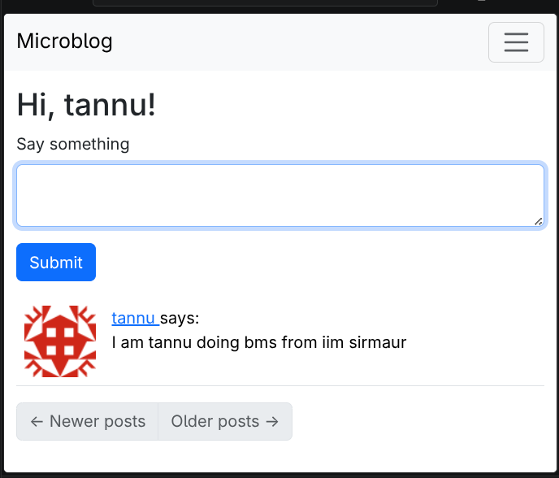

# BlogSite
Making a blogsite with flask using a tutorial. Trying to learn along the way

Made it till here 

and this page. took a lot of time. I need to do better documenting. Why is it such a task? I am pretending no one is going to read it (which is true), but here we go. I am just trying to see my learning curve
I think mainly I have just spent my time fixing stupid errors, which are just typos and that's it. But I have promised myself that I will complete this tutorial for sure. It's quite irritating at times, but I guess I have seen some progress. I am typing everything by myself to get order to understand it in a much better way. 
I want to talk about the technicalities that i got to know I think I should writing a blog. why am i ranting here nvm bye
Did a lot actually I have started enjoy all this.
Made the website prettier. That was just copying source code I don't like designing. Used bootstrap which gave me pre-built CSS.
 It's better looking